# List Reseller Hosting and Domain
by David Adi Nugroho \<davidadi216@gmail.com\>  
last update: Feb, 11th 2018

## Reseller Hosting

### Local (Indonesia)

#### jagoanhosting.com

**ID**  
https://www.jagoanhosting.com/reseller-hosting-indonesia/
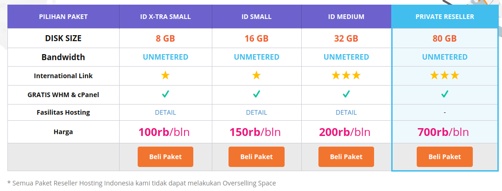

**US**  
https://www.jagoanhosting.com/reseller-hosting-murah/

**Main Features:**
* Free WHM
* Free CPanel
* Free Private Name Server
* Free Setup Hosting
* 30-days Money Back Guaranted

Reseller hosting at jagoanhosting does not include WHMCS (billing management) and can not Overselling Space.

#### idcloudhost.com
https://idcloudhost.com/reseller-hosting-murah-indonesia/
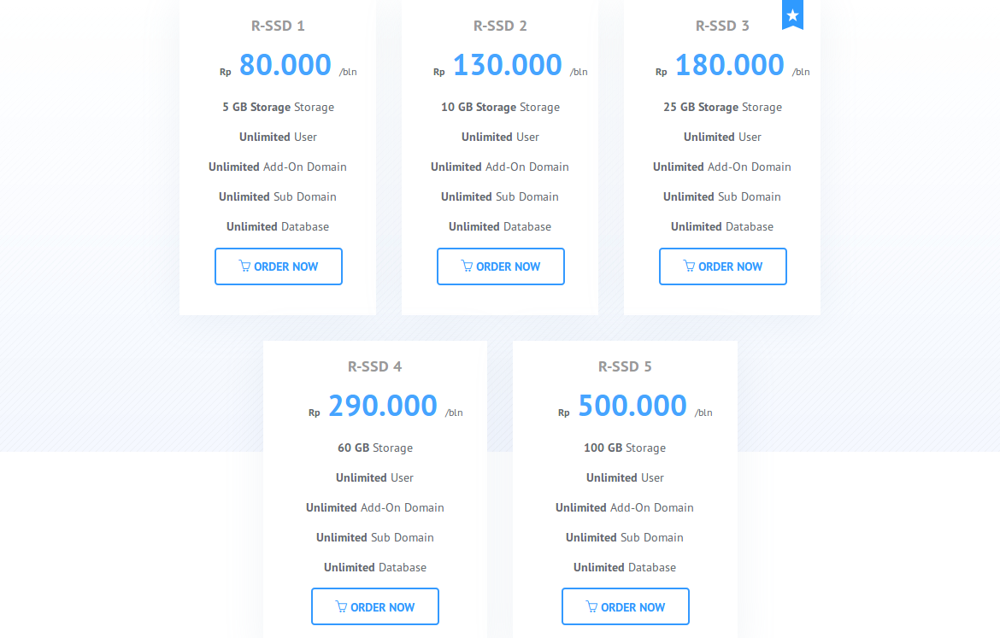

**Main Features:**
* Free Reseller Panel
* Free WHM (for creating hosting package only)
* Free Cpanel
* Free Private Name Server

Reseller hosting at idcloudhost does not include WHMCS (billing management)

#### dapurhosting.com
http://dapurhosting.com/reseller-hosting
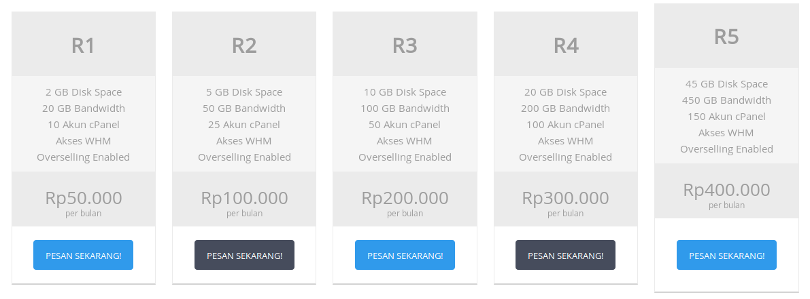

**Main Features:**
* Free WHM
* Free Cpanel
* 30-days Money Back Guaranted

Reseller hosting at idcloudhost does not include WHMCS (billing management)

#### dhyhost.com
**Reseller Hosting Server Indonesia SSD**  
https://www.dhyhost.com/reseller-hosting-indonesia/
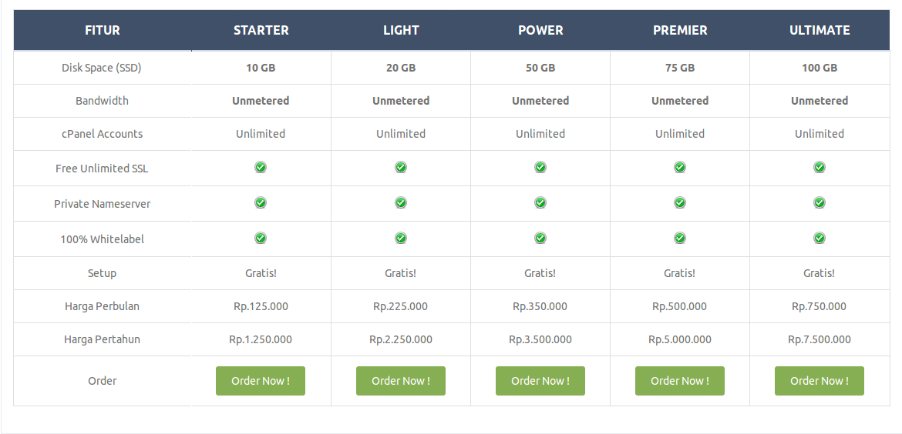

**Reseller Hosting Server SSD USA**  
https://www.dhyhost.com/budget-reseller-hosting/
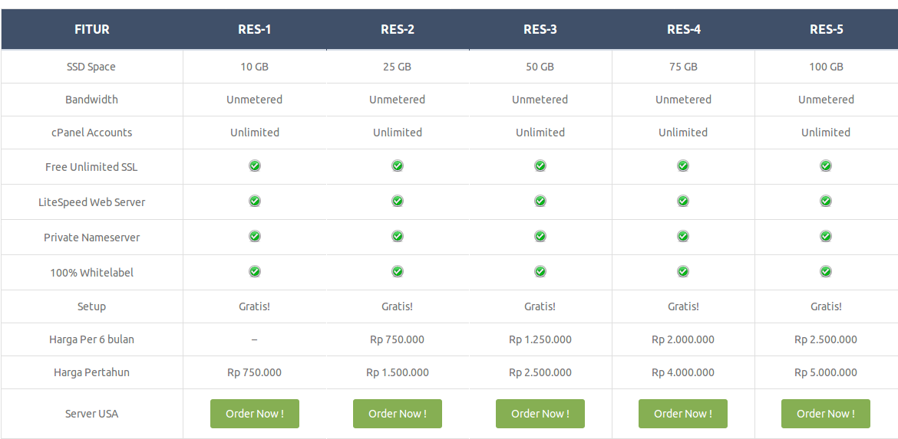

**Main Features:**
* Free Cpanel
* Free Private Name Server

#### qwords.com
**Private Label Hosting Reseller**  
https://www.qwords.com/reseller/private-label-hosting-reseller/
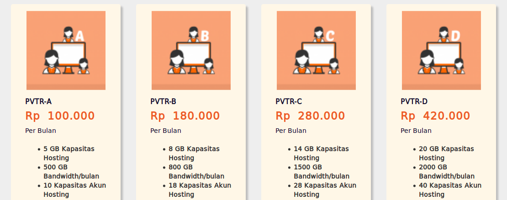

**Main Features:**
* Free Private Name Server
* Free WHM
* Free Cpanel
* Free Setup
* Upgradeable

Additional:
* WHMCS Lisence = Rp.180.000/Month (Branding) /Rp.200.000/Month (Non Branding)
* 1 Public Dedicated IP Address = Rp.100.000/Month
* Overusage Bandwidth = Rp.20.000/GB/Month
* Downgrade = Rp.25.000

\*Price does not include Tax.

#### id.resellerclub.com
**Reseller Hosting - Linux**  
https://id.resellerclub.com/products/reseller-hosting-linux  
* US
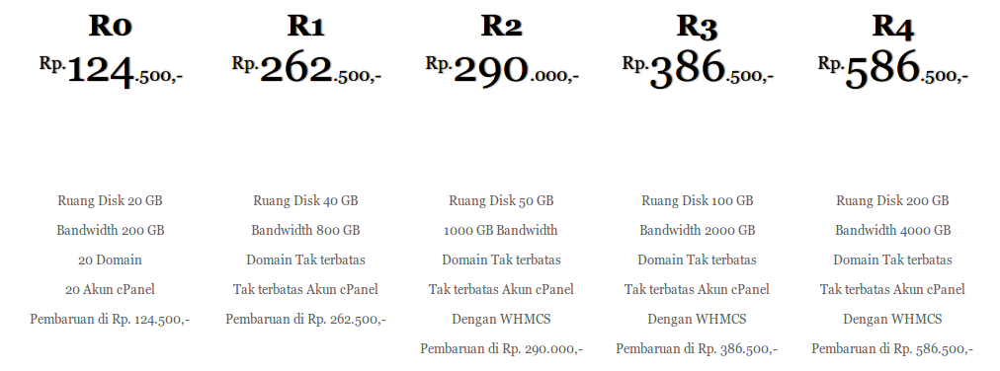
* INDIA
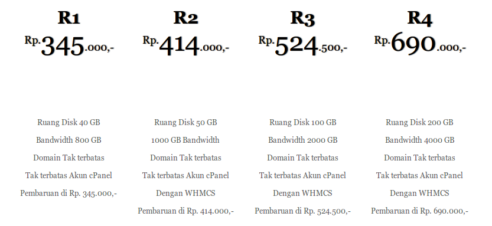
* UK
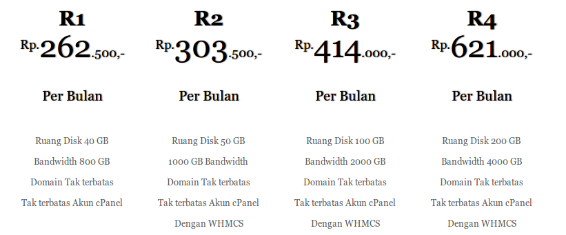

**Main Features:**
* Free WHM
* Free Cpanel
* Free WHMCS (based on package)
* Free Private Name Server

**Reseller Hosting - Windows**
* US

* INDIA
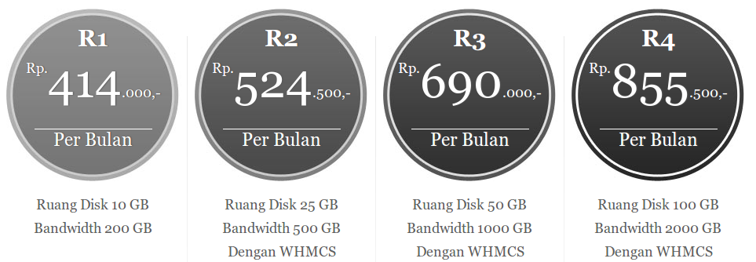
* UK
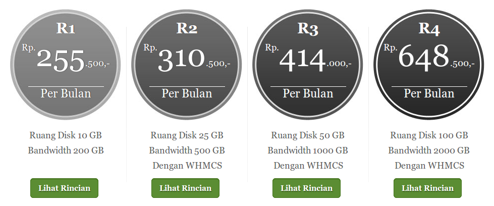

**Main Features:**
* Free Plesk
* Free Private Name Server

#### drupadi.com
**Master Reseller Hosting USA**  
https://drupadi.com/master-reseller-hosting-usa-free-whmcs/
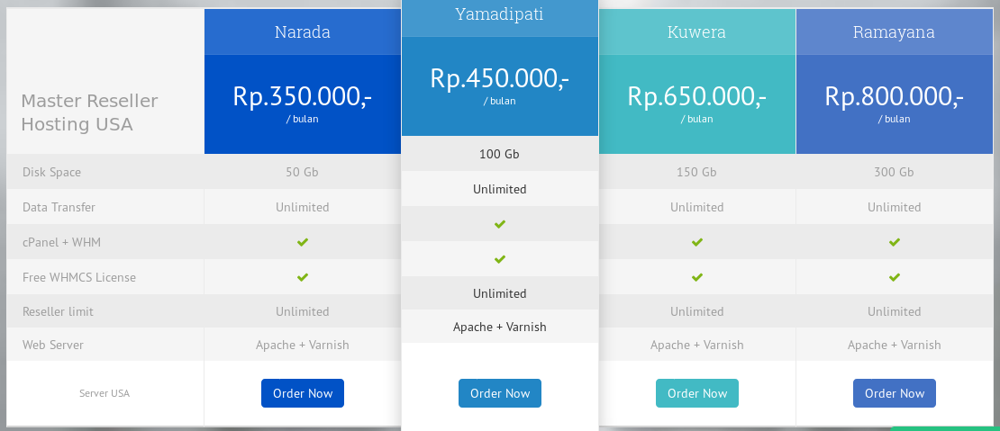

Main Features:
- Free WHM
- Free WHMPP
- Free WHMCS
- Free Private Name Server
- Upgradable
- Unliited Reseller (can Oversell)

### International

#### namehero.com
https://www.namehero.com/reseller-hosting.php
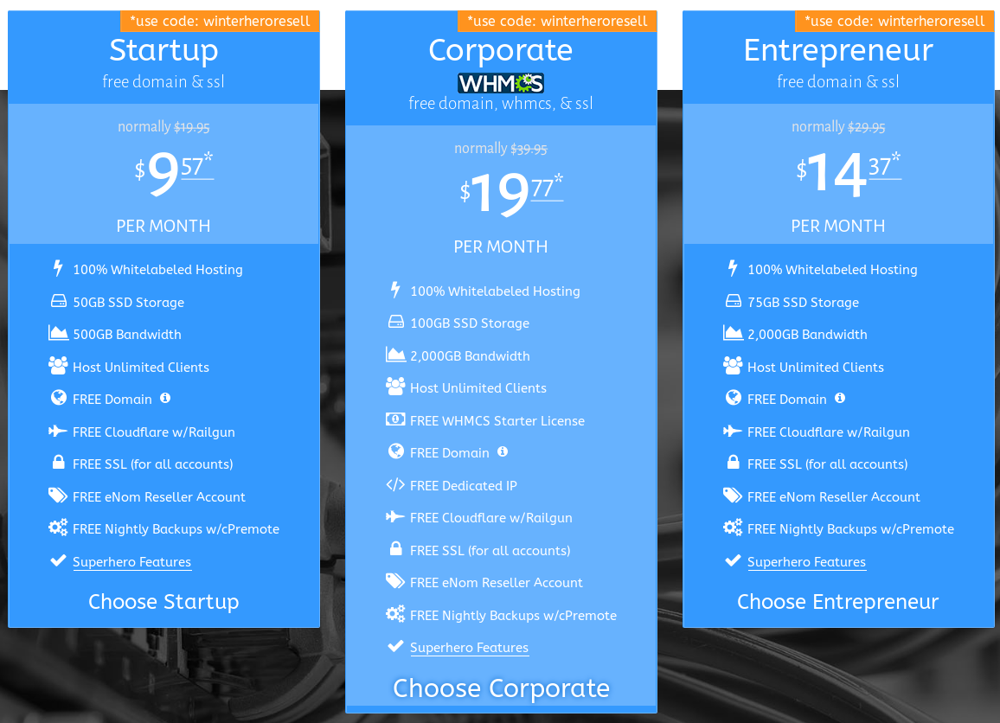

#### inmotionhosting.com
https://www.inmotionhosting.com/reseller-hosting
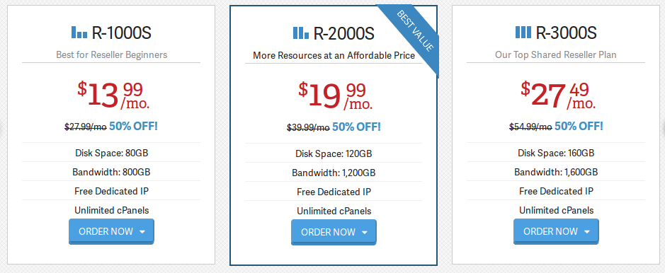
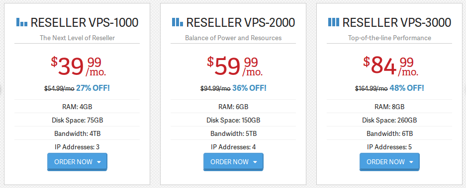

**Main Features:**
* SSD reseller hosting with FREE cPanel/WHM access
* Keep your reseller web hosting biz organized with WHMCS
* FREE dedicated IP and site backups
* Tons of email features with IMAP and POP3 support
* Manage your reseller domains with FREE eNom license

#### a2hosting.com
https://www.a2hosting.com/reseller-hosting
**Linux**
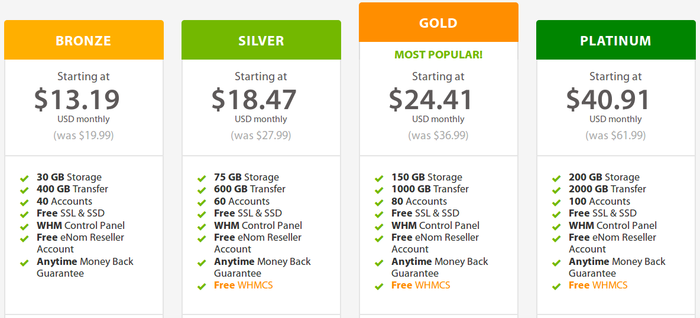
**Windows**

**Main Features:**
* Unlimited reseller hosting plans for Linux or Windows
* FREE eNom account to manage unlimited websites
* Server rewind backups and up to 2,000GB of data transfer
* FREE SSDs, a CDN, and choice of datacenter location
* 99.9% uptime commitment and 24/7 network monitoring

#### hostgrator.com
https://www.hostgator.com/reseller-hosting/
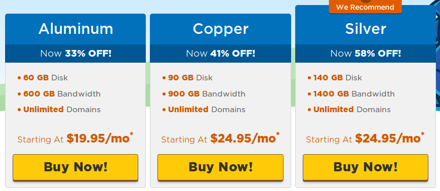

**Main Features:**
* Start your own company with cPanel reseller hosting
* Unlimited domains, emails, and MySQL databases
* 99.9% uptime guarantee and 400+ tutorials for your clients
* All web hosting reseller plans include WHMCS
* $200 in Yahoo!, Bing, and Google Adwords credits

#### siteground.com
https://www.siteground.com/reseller_hosting.htm
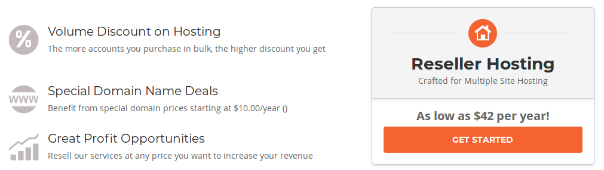

**Main Features:**
* Reseller hosting credits for as little as $42/credit/year
* Get more accounts in bulk for higher discounts
* Reseller domain names as low as $10 per year
* Unlimited MySQL databases and data transfer
* FREE CloudFlare CDN, plus cPanel and SSH access

#### from http://www.hostingadvice.com/reviews/reseller-hosting/
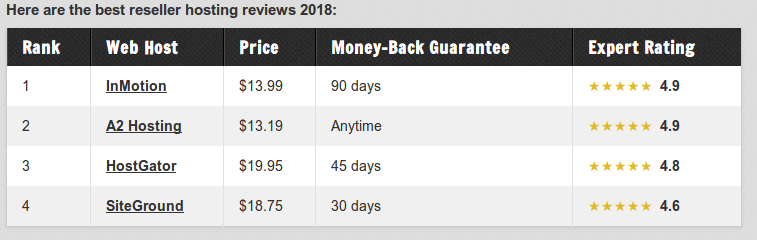

## Reseller Domain

### Local (Indonesia)

#### idcloudhost.com
https://idcloudhost.com/reseller-domain-murah/
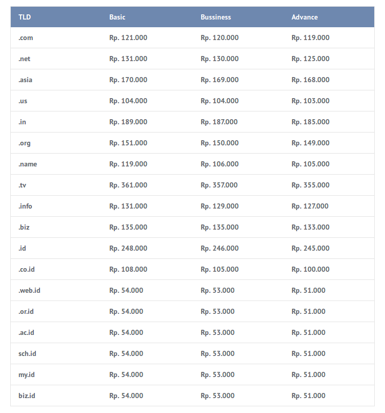

Minimum deposit:
* Basic Rp 100.000
* Business Rp 1.000.000
* Advance Rp 3.000.000

#### dapurhosting.com
http://dapurhosting.com/reseller-domain-id
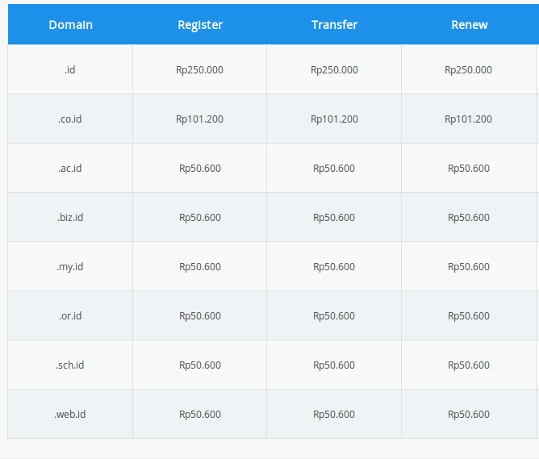

Minimum deposit Rp. 500.000

#### dhyhost.com

**Local Domain**  
https://www.dhyhost.com/reseller-domain-indonesia/
* Base
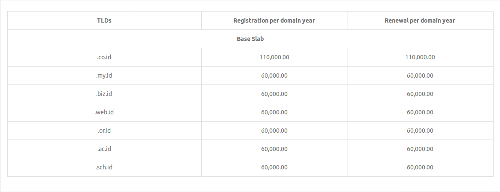
* Stab 1
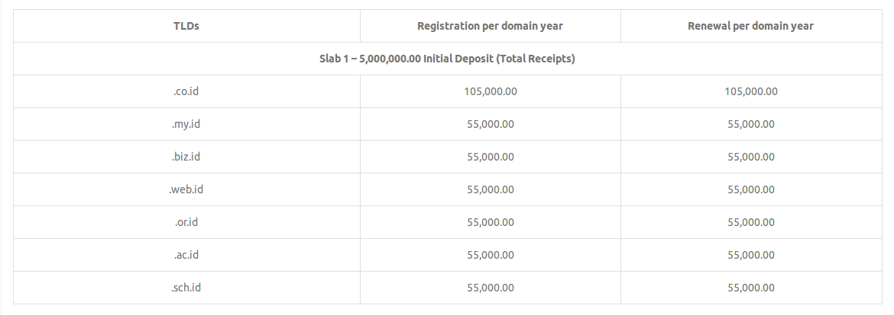

**International Domain**  
http://reseller.dhyhost.com/reseller.php?action=pricing
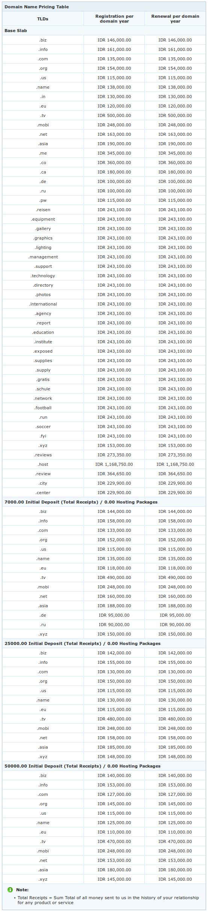

\*Price does not include PPN 10%. PPN will automatically cut when doing deposit. Minimum deposit at dhyhost Rp. 250.000

#### qwords.com
https://www.qwords.com/reseller/private-label-domain-reseller/

**Local Domain**  
partner with https://irsfa.id
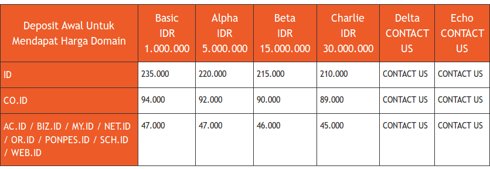

**International Domain**  
http://domreseller.qwords.com/reseller.php?action=pricing
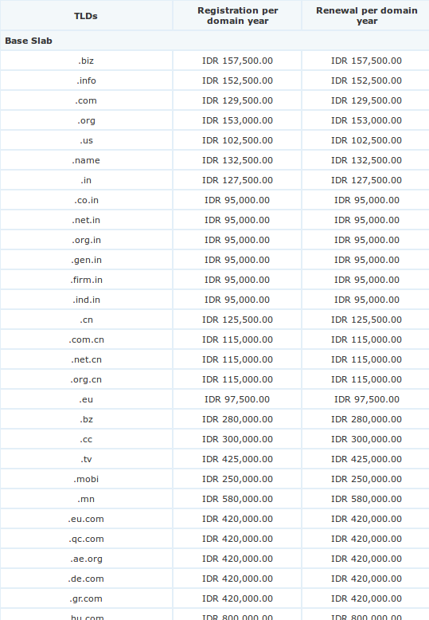

For more visit the link.

Minimum deposit Rp.1.000.000, next minimum deposit Rp.500.000. Registration with KTP and SIUP/TDP (for company). Without yearly charge and never expired deposit. Can get SLAB discount after reaching some client purchase.

#### domainesia.com
https://www.domainesia.com/reseller-domain/

**Local Domain**
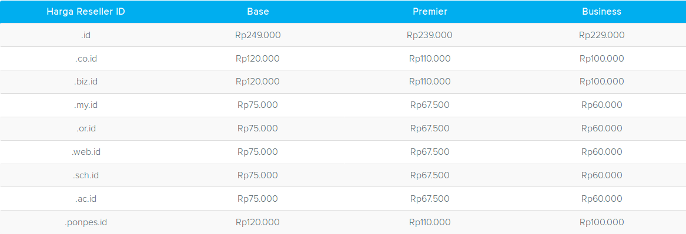
**International Domain**
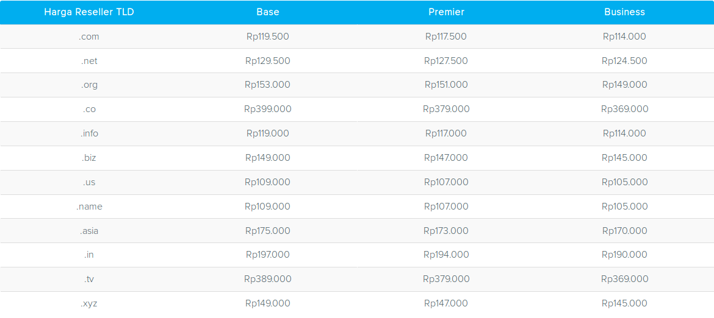

Deposit:
* Base Rp 100.000
* Premier Rp 1.000.000
* Business Rp 3.000.000

**Features:**
* Integrated Shopping Cart Design ready to use
* Can create Sub-reseller
* Rich feature and easy to use Control Panel
* Support integration WHMCS
* Cheaper price for reseller

## Thanks to 
* http://www.hostingadvice.com/reviews/reseller-hosting/